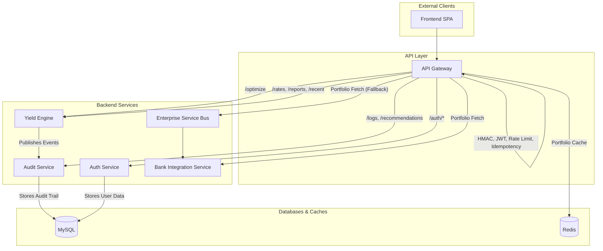

# Architecture, Routing, and Business Logic

This document provides a high-level overview of the application's architecture, how requests are routed, and where key business logic resides.

## System Architecture

The application is designed as a set of cooperating microservices. This approach was chosen to separate concerns, improve scalability, and allow for independent development and deployment of different parts of the system.

The main services are:

-   **Frontend:** A single-page application (SPA) that provides the user interface for relationship managers. It is a "thin" client that relies on the backend for all business logic.
-   **API Gateway:** The single entry point for all client requests. It handles cross-cutting concerns like authentication, rate limiting, and logging, and it routes requests to the appropriate downstream service.
-   **Auth Service:** A centralized service for managing user identity. It handles user login, token issuance (JWT), and token validation.
-   **Yield Engine:** This is the "brain" of the application. It contains the complex financial models and business rules required to calculate and compare the effective yields of FCNR and NRE deposits.
-   **Audit Service:** Provides a persistent, append-only ledger of all advisory calculations and recommendations. This is crucial for compliance and regulatory purposes. It also handles the generation of PDF reports.
-   **Bank Integration Service:** Acts as an adapter to the Core Banking System (CBS). Its responsibility is to fetch customer data, such as their existing portfolio of assets and liabilities. In a non-production environment, it can provide mock data.
-   **ESB (Enterprise Service Bus):** A lightweight message router used for specific internal communication patterns, helping to decouple services. For example, it can be used to route a request for a customer's portfolio from the Gateway to the Bank Integration Service.

### Architecture Diagram

## Request Flow Example: The `/optimize` Endpoint

To understand how the services interact, let's trace a call to the main `POST /optimize` endpoint. This flow highlights the **data enrichment** role played by the gateway.

1.  A Relationship Manager (user) submits a request from the **Frontend**.
2.  The request hits the **API Gateway**.
3.  The **Gateway**'s middleware performs standard checks: JWT validation, HMAC signature verification, idempotency key check, and rate limiting.

4.  **Gateway Orchestrates Portfolio Fetching:** Before forwarding the request, the Gateway enriches the payload. If the incoming request *does not* already contain the customer's `assets` and `liabilities`, the Gateway attempts to fetch them in the following order:
    a.  **Check Redis Cache:** It first looks for a cached portfolio for the `customer_id` in Redis. If found, this cached data is used (`X-Portfolio-Source: CACHE_HIT`).
    b.  **Fetch from Bank Integration Service:** On a cache miss, it attempts to fetch the portfolio directly from the `bank-integration-service`.
    c.  **Fallback to ESB:** If the `bank-integration-service` is unreachable, it falls back to fetching the data via the `esb`.
    d.  **Cache the Result:** If the data is fetched successfully from a source, it's cached in Redis for future requests.
    e.  **Failure:** If all sources are unavailable, the Gateway returns a `503 Service Unavailable` error.

5.  **Forward "Fat Payload" to Yield Engine:** The Gateway combines the original request with the fetched portfolio data (if any) into a single, "fat payload". This payload is then forwarded to the **Yield Engine**'s `/optimize` endpoint. The source of the portfolio is noted in an `X-Portfolio-Source` header.

6.  **Yield Engine Executes Core Logic:** The **Yield Engine** now has all the data it needs. It performs the complex financial calculations:
    -   Validates the request against business rules.
    -   Applies ALM penalties.
    -   Calculates and compares the effective yields for FCNR and NRE deposits.
    -   Determines the final recommendation.

7.  **Asynchronous Audit:** The **Yield Engine** asynchronously sends the full recommendation and decision trace to the **Audit Service**, where it is persisted in the MySQL database.

8.  **Response Path:**
    -   The **Yield Engine** returns the final recommendation to the **API Gateway**.
    -   The **API Gateway** logs the response and relays it back to the **Frontend**.
    -   The **Frontend** displays the recommendation to the user.

This flow illustrates the separation of concerns: the Gateway handles security and data enrichment, the Yield Engine performs pure business logic, and the Audit Service ensures compliance.
