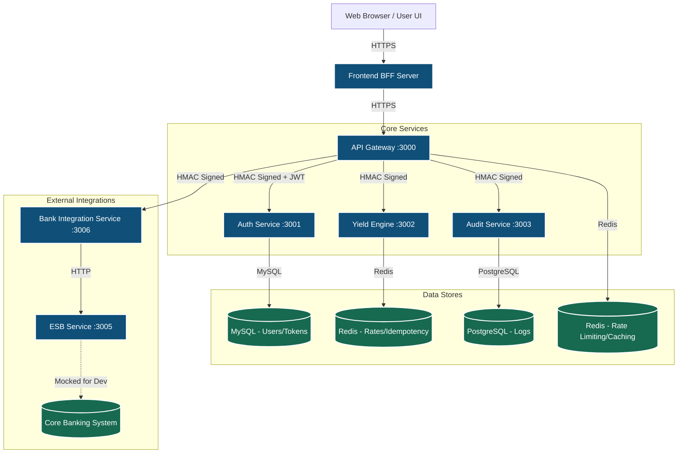
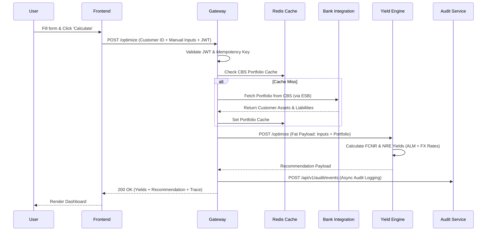

# 1. Architecture & Design Documentation

This document outlines the high-level architecture, data flows, and API specifications for the NRI Yield Advisory System.

## System Architecture Diagram

The system employs a decentralized microservice architecture with an API Gateway acting as the central entry point and authenticator.



## Data Flow Diagram: Recommendation Request

When an RM requests a yield optimization (`POST /optimize`), data flows through multiple layers, integrating real-time user inputs, cached portfolios, and financial models.



> [!WARNING]
> **Data Privacy Checkpoint:** Customer IDs and Portfolio balances (PII/Financial Data) are processed by the Gateway, Yield Engine, and Bank Integration. They are stored temporarily in Redis (Cache) and permanently in PostgreSQL (Audit Logs). All inter-service traffic carrying this data must be protected by HMAC-SHA256 signatures.

## API Specifications

### `POST /api/v1/auth/login`
- **Description:** Authenticates user and issues access/refresh tokens.
- **Request Body:**
  ```json
  {
    "email": "rm.test@csb.co.in",
    "password": "password123"
  }
  ```
- **Response:** `200 OK`
  ```json
  {
    "access_token": "eyJhbGci...",
    "refresh_token": "8a7b6c...",
    "user": {
      "employee_id": "EMP001",
      "name": "Test RM",
      "email": "rm.test@csb.co.in",
      "role": "RM",
      "branch_code": "GIFT-001"
    }
  }
  ```

### `POST /optimize`
- **Description:** Generates yield optimization advice based on user inputs and CBS portfolio.
- **Headers:** 
  - `Authorization: Bearer <token>`
  - `Idempotency-Key: <uuid>`
- **Request Body:**
  ```json
  {
    "customer_id": "CUST123",
    "base_currency": "USD",
    "principal_amount": "50000.00",
    "tenure_months": 12,
    "assets": [],
    "liabilities": []
  }
  ```
- **Response:** `200 OK`
  ```json
  {
    "metadata": { "recommendation_id": "uuid", "computed_at": "ISO8601" },
    "advisory": {
      "recommended_product": "FCNR",
      "projection": { ... }
    },
    "decision_trace": { ... }
  }
  ```

### `GET /history`
- **Description:** Retrieves recent optimization requests.
- **Query Params:** `limit=50`
- **Behavior:** Only ADMIN and AUDITOR roles can view history globally (by passing `employee_id` query param). Standard RMs can only view their own history.

### `GET /reports/:recommendationId`
- **Description:** Generates a PDF report for a specific recommendation.
- **Authentication:** Can use `Authorization: Bearer` header or `?token=<jwt>` query parameter.
